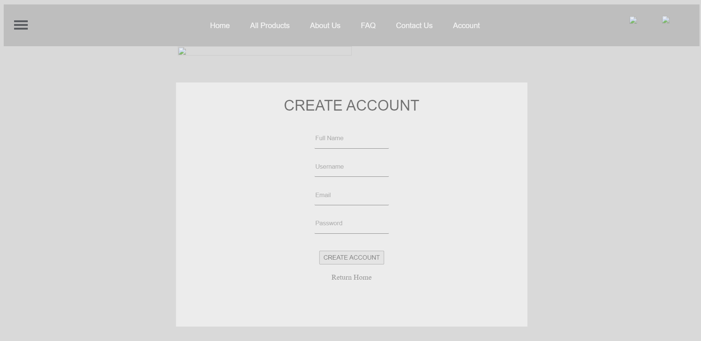
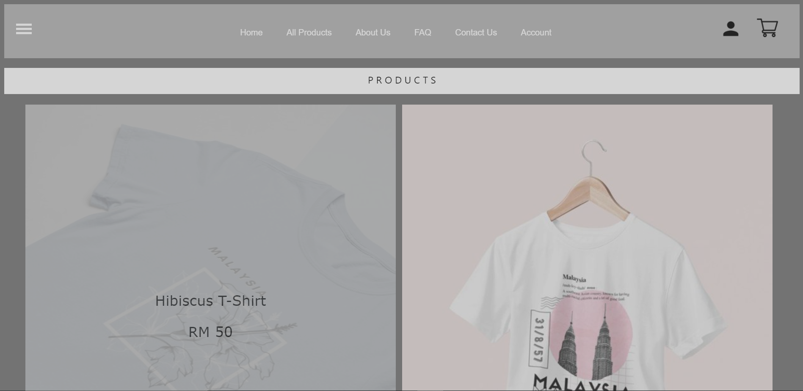
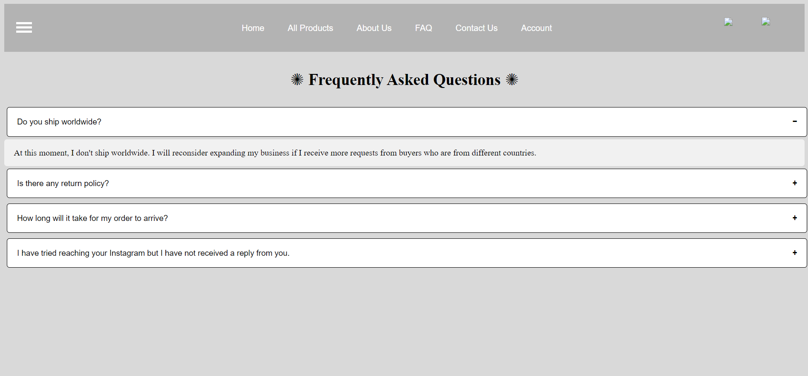

# Mirs-Studio
My first website project! This was done as a group assignment alongside my 4 other teammates.

## Overview
Mir Studio is an e-commerce website that aims to allow Mir to showcase her artworks and merchandises to the public to be able to view them and place orders. The website is built using HTML, CSS, JavaScript and PHP.

## Screenshots

